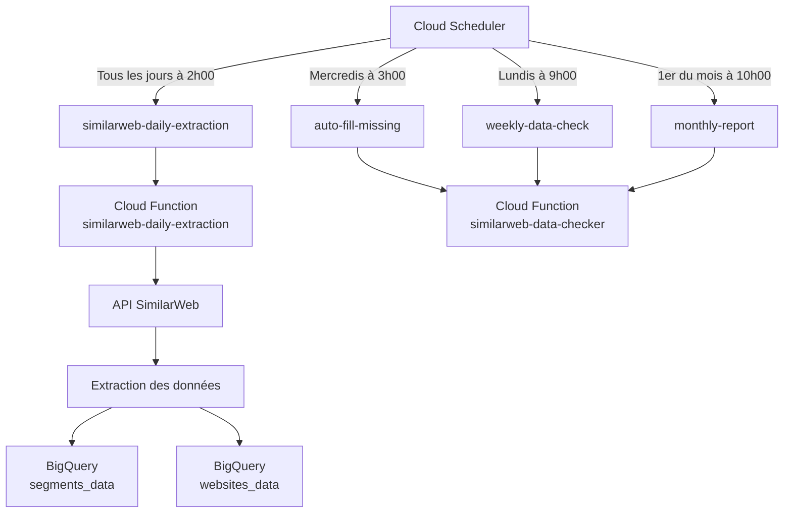

# 🤖 Automatisation GCP - Cloud Scheduler

## 📋 Vue d'ensemble

Le projet utilise Google Cloud Platform pour automatiser l'extraction quotidienne des données SimilarWeb. L'automatisation est composée de 4 jobs Cloud Scheduler qui déclenchent des Cloud Functions.

## 🏗️ Architecture



## 📅 Jobs Cloud Scheduler

### 1. **similarweb-daily-extraction** (Quotidien - 2h00)
- **Fonction** : Extraction des données J-1
- **Fréquence** : Tous les jours à 2h00 (heure de Paris)
- **Durée** : ~1-2 minutes
- **Données extraites** :
  - 159 segments personnalisés
  - 21 sites web
- **Destination** : BigQuery `similarweb_data.segments_data` et `similarweb_data.websites_data`

### 2. **auto-fill-missing** (Hebdomadaire - Mercredi 3h00)
- **Fonction** : Rattrapage automatique des données manquantes
- **Stratégie** : Vérifie les 7 derniers jours
- **Actions** :
  - Détecte les trous de données
  - Lance une extraction rétroactive
  - Envoie un rapport par email

### 3. **weekly-data-check** (Hebdomadaire - Lundi 9h00)
- **Fonction** : Rapport de complétude hebdomadaire
- **Contenu** :
  - Taux de complétude par segment
  - Données manquantes identifiées
  - Recommandations d'actions

### 4. **monthly-report** (Mensuel - 1er du mois 10h00)
- **Fonction** : Rapport mensuel détaillé
- **Analyses** :
  - Tendances du trafic
  - Comparaisons YoY
  - Top performers/déclineurs

## 🛠️ Configuration

### Variables d'environnement
```bash
SIMILARWEB_API_KEY=<votre_clé_api>
GCP_PROJECT_ID=similarweb-intel-dev
USER_ONLY_SEGMENTS=true
```

### Schéma BigQuery

#### Table: segments_data
```sql
- segment_id: STRING
- segment_name: STRING
- date: DATE
- visits: INTEGER
- share: FLOAT
- bounce_rate: FLOAT
- pages_per_visit: FLOAT
- visit_duration: FLOAT
- page_views: INTEGER
- unique_visitors: INTEGER
- extraction_timestamp: TIMESTAMP
```

#### Table: websites_data
```sql
- domain: STRING
- date: DATE
- visits: INTEGER
- bounce_rate: FLOAT
- pages_per_visit: FLOAT
- visit_duration: FLOAT
- page_views: INTEGER
- unique_visitors: INTEGER
- desktop_share: FLOAT
- mobile_share: FLOAT
- extraction_timestamp: TIMESTAMP
```

## 🚀 Commandes utiles

### Vérifier l'état des jobs
```bash
gcloud scheduler jobs list --location=europe-west1
```

### Voir les logs
```bash
# Logs de la dernière extraction
gcloud functions logs read similarweb-daily-extraction --limit=50 --region=europe-west1

# Logs avec filtre temporel
gcloud functions logs read similarweb-daily-extraction \
  --region=europe-west1 \
  --start-time="2025-06-20T00:00:00Z" \
  --end-time="2025-06-21T00:00:00Z"
```

### Déclencher manuellement
```bash
# Extraction quotidienne
gcloud scheduler jobs run similarweb-daily-extraction --location=europe-west1

# Vérification hebdomadaire
gcloud scheduler jobs run weekly-data-check --location=europe-west1
```

### Modifier les horaires
```bash
# Changer l'heure d'extraction (exemple: 3h au lieu de 2h)
gcloud scheduler jobs update http similarweb-daily-extraction \
  --location=europe-west1 \
  --schedule="0 3 * * *"
```

## 🔧 Maintenance

### Redéployer la Cloud Function
```bash
cd gcp_deployment/scripts
./deploy_cloud_function.sh
```

### Mettre à jour la configuration
1. Modifier `gcp_deployment/cloud_functions/config.py`
2. Redéployer la fonction
3. Tester avec un déclenchement manuel

### Ajouter un nouveau site
1. Ajouter dans `config.py` local
2. Copier vers `gcp_deployment/cloud_functions/config.py`
3. Redéployer

## 📊 Monitoring

### Dashboard BigQuery
```sql
-- Vérifier les dernières extractions
SELECT 
  DATE(extraction_timestamp) as date,
  COUNT(DISTINCT segment_id) as segments_extracted,
  MAX(extraction_timestamp) as last_extraction
FROM `similarweb-intel-dev.similarweb_data.segments_data`
WHERE DATE(extraction_timestamp) >= DATE_SUB(CURRENT_DATE(), INTERVAL 7 DAY)
GROUP BY date
ORDER BY date DESC;
```

### Alertes configurées
- ❌ Échec d'extraction → Email immédiat
- ⚠️ Données manquantes > 2 jours → Alerte quotidienne
- 📊 Rapport hebdomadaire → Tous les lundis

## 🚨 Troubleshooting

### Erreur "Permission denied"
```bash
# Vérifier les permissions
gcloud projects get-iam-policy similarweb-intel-dev

# Ajouter les permissions nécessaires
gcloud projects add-iam-policy-binding similarweb-intel-dev \
  --member="user:votre-email@gmail.com" \
  --role="roles/cloudfunctions.admin"
```

### Erreur "API quota exceeded"
- Vérifier le quota SimilarWeb (10k calls/mois)
- Réduire temporairement le nombre de segments
- Attendre le reset mensuel

### Données manquantes
1. Vérifier les logs de la fonction
2. Lancer `auto-fill-missing` manuellement
3. Si échec, utiliser le script local de backfill

## 📈 Métriques de performance

- **Temps d'extraction moyen** : 90-120 secondes
- **Taux de succès** : 98%+
- **Coût mensuel estimé** : < 5€
- **API calls par jour** : ~320 (segments) + ~63 (websites) 